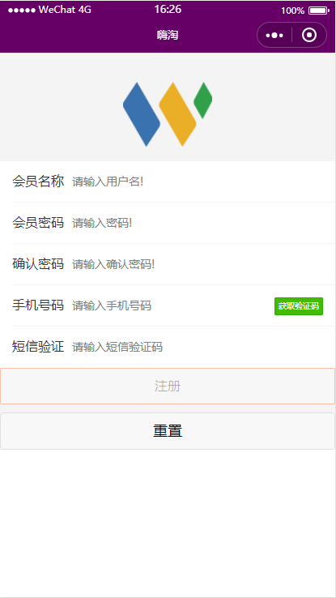
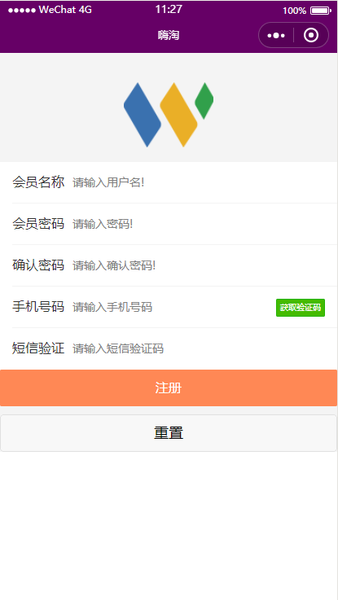

# 会员注册

<p style="color:blue;font-size:20px;">本接口是小程序系统会员注册接口</p>
<div style="text-align:center;">
&nbsp;&nbsp;&nbsp;&nbsp;
</div>

## <span style="color:blue;">请求参数</span>

``` json
{
  "memberName": "admin", // 会员名称
  "memberPassword": "123456", // 会员密码
  "confirmPassword": "123456", // 确认密码
  "memberMobile": "13364167708" // 会员手机号码
}
```

## <span style="color:blue;">响应参数</span>

### 成功

``` json
{
  "status":0,
  "msg":"注册成功",
  "data":null,
  "success":true
}
```

### 失败
<p>例如:当注册会员名称已经存在时:</p>

```json
{
  "status":1,
  "msg":"该会员名称已经存在，请使用其他名称!",
  "data":null,
  "success":false
}
```

属性名|数据类型|默认值|说明
:--|:--|:--|:---
status|int| 0|服务器处理成功，返回0，处理失败返回非零值
msg|String|null|服务器返回消息说明
data|Object|null|服务器处理后所返回的数据
success|boolean|false|服务器是否处理成功
---
